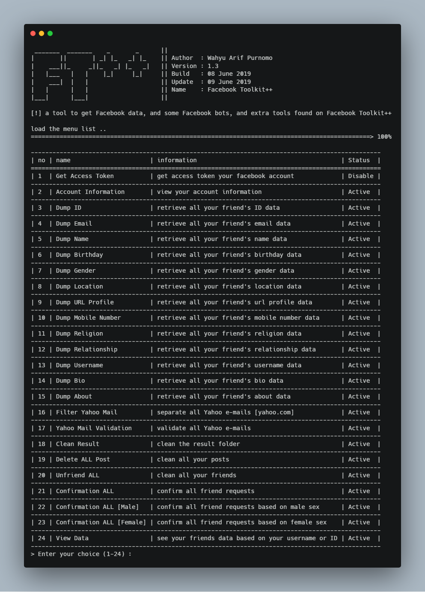
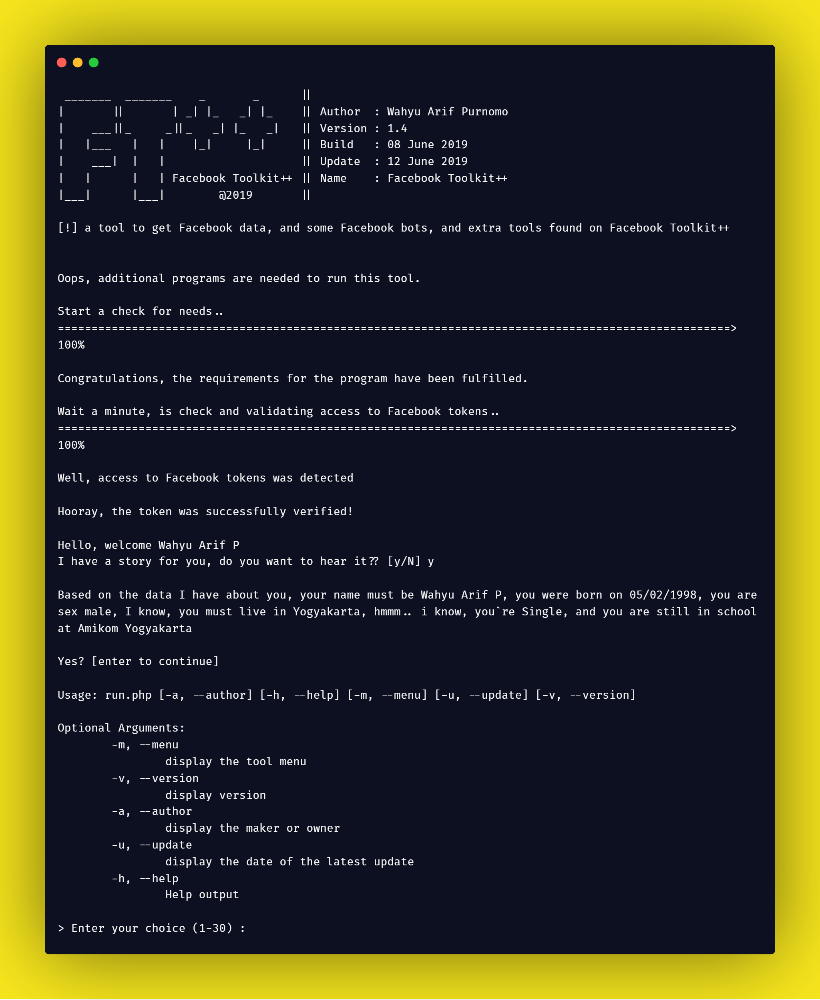
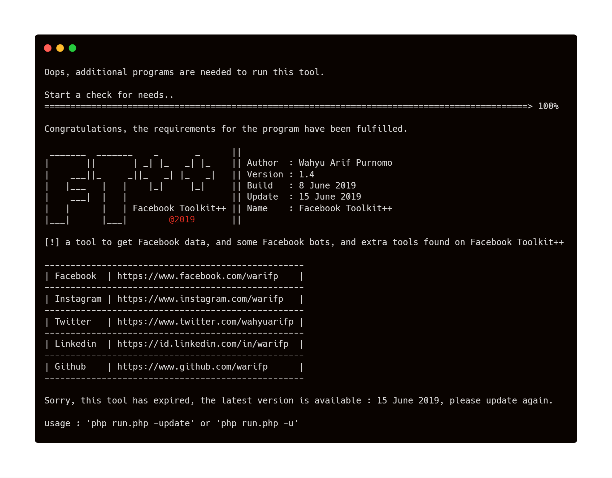
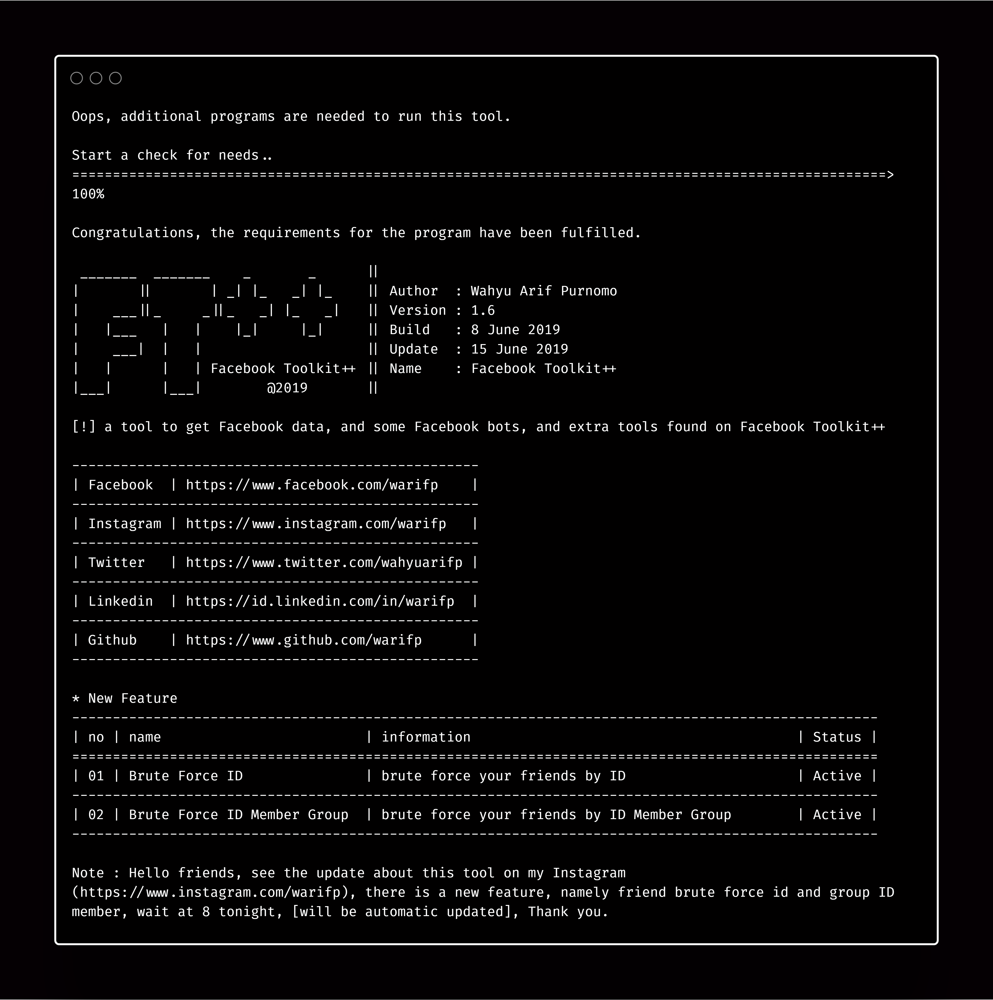

<H1 align="center">
FACEBOOK TOOLKIT
</H1>
<H4 align="center">
a tool to get Facebook data, and some Facebook bots, and extra tools found on Facebook Toolkit ++. 
Graph API Facebook. 
</H4>

 

Made with ❤️ by <a href="https://github.com/warifp">Wahyu Arif Purnomo</a>

  
  

  <a>  UPDATE 1.4  </a>
  

  <a>  UPDATE 1.5  </a>
  

  <a>  UPDATE 1.6  </a>
  

## Features in tools

| Name                               | Status             | Information                                        |
| ---------------------------------- | ------------------ | -------------------------------------------------- |
| Get Access Token                   | :white_check_mark: | get access token your facebook account             |
| Account Information                | :white_check_mark: | view your account information                      |
| Dump ID                            | :white_check_mark: | retrieve all your friend's ID data                 |
| Dump Email                         | :white_check_mark: | retrieve all your friend's Email data              |
| Dump Name                          | :white_check_mark: | retrieve all your friend's Name data               |
| Dump Birthday                      | :white_check_mark: | retrieve all your friend's Birthday data           |
| Dump Gender                        | :white_check_mark: | retrieve all your friend's Gender data             |
| Dump Location                      | :white_check_mark: | retrieve all your friend's Location data           |
| Dump URL Profile                   | :white_check_mark: | retrieve all your friend's url profile data        |
| Dump Mobile Number                 | :white_check_mark: | retrieve all your friend's mobile number data      |
| Dump Religion                      | :white_check_mark: | retrieve all your friend's religion data           |
| Dump Username                      | :white_check_mark: | retrieve all your friend's username data           |
| Dump Bio                           | :white_check_mark: | retrieve all your friend's bio data                |
| Dump About                         | :white_check_mark: | retrieve all your friend's about data              |
| Filter Yahoo Mail                  | :white_check_mark: | separate all Yahoo e-mails [yahoo.com]             |
| Yahoo Mail Validation              | :white_check_mark: | validate all Yahoo e-mails                         |
| Clean Result                       | :white_check_mark: | clean the result folder                            |
| Delete ALL Post                    | :white_check_mark: | clean all your posts                               |
| Unfriend ALL                       | :white_check_mark: | clean all your friends                             |
| Confirmation ALL                   | :white_check_mark: | confirm all friend requests                        |
| Confirmation ALL [Male]            | :white_check_mark: | confirm all friend requests based on male sex      |
| Confirmation ALL [Female]          | :white_check_mark: | onfirm all friend requests based on female sex     |
| View Data                          | :white_check_mark: | see your friends data based on your username or ID |
| Dump ID Member Group               | :white_check_mark: | retrieve all ID member on group database           |
| Dump Username Profile Member Group | :white_check_mark: | retrieve all username member on group database     |
| Dump URL Profile Member Group      | :white_check_mark: | retrieve all url profile member on group database  |
| Brute Force ID                     | :white_check_mark: | brute force your friends by ID                     |
| Brute Force ID Member Group        | :white_check_mark: | brute force Member Group by ID                     |

## Version

Version 1.0 :

    https://www.facebook.com/warifp/videos/2340053176234744/

  Changelog :

-   Add tools

Version 1.2 :

    https://www.facebook.com/warifp/videos/2339461559627239/

  Changelog :

-   Add tools++

Version 1.3 :

    https://www.facebook.com/photo.php?fbid=2340608509512544

  Changelog : 

-   re-build with Climate
-   compress system
-   add engine file
-   add color file
-   add random file
-   change folder result
-   add folder and file config

Version 1.4 :

    https://www.facebook.com/warifp/videos/2340053176234744/

  Changelog :

-   add get ID Member Group
-   add get Username Member Group
-   add get URL Profile Member Group
-   add arguments menu, version, last update.
-   add auto check requirements
-   add auto check validation access token
-   add story
-   add comment step
-   compress function
-   display improvements
-   and other improvements

Version 1.5 :

    https://www.facebook.com/photo.php?fbid=2345150569058338

  Changelog :

-   fix feature
-   fix library
-   and other.

## Installation

### Windows or Linux
You can download the latest composer in [here](https://getcomposer.org/download/).

    git clone https://github.com/warifp/FacebookToolkit

    composer 
    
### Termux

    pkg install php

    pkg install curl

    pkg update

    git clone https://github.com/warifp/FacebookToolkit

## Requirements for using this tool

We need several requirements to use this tool to run smoothly.

##### Linux

##### Windows

## Usage

Enough to execute the command :

    php run.php

Cek list menu tools, use the command : 

    php run.php -m

Cek author, use the command : 

    php run.php -a

Cek version, use the command : 

    php run.php -v

Cek update, use the command : 

    php run.php -u

and help, use the command : 

    php run.php -h

and don't forget to ask at [issue page](https://github.com/warifp/FacebookToolkit/issues)
If you have additional information, you can make it on the [issue page](https://github.com/warifp/FacebookToolkit/issues).

## Thanks

Thank you for all.

1.  CLIMate Library : [CLIMate](https://climate.thephpleague.com/).
2.  PHP CLI Color Class : [PHPColor](https://www.if-not-true-then-false.com/2010/php-class-for-coloring-php-command-line-cli-scripts-output-php-output-colorizing-using-bash-shell-colors/).
3.  ASCII Art Generator : [TAAG](http://patorjk.com/software/taag).

## Donation

    If you want to buy my coffee, you can send payments Paypal.

## Disclaimer

This is an open source for everyone, you may redistribute, modify, use patents and use privately without any obligation to redistribute. but it should be noted to include the source code of the library that was modified (not the source code of the entire program), include the license, include the original copyright of the author (warifp), and include any changes made (if modified). Users do not have the right to sue the creator when there is damage to the software or even demand if there is a problem caused by the makers of this tool. because every risk is caused by the user risk itself.
